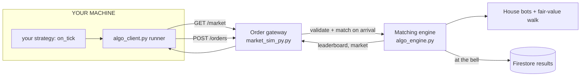

# Market Simulation Py — How It Works & How to Play

A complete guide to the client-side algo-trading game: what it is, how it's
built, the logic underneath, and how to write a bot that wins.

If you've never looked at the code, start here. It assumes you know a little
Python but nothing about how the game is put together.

> **Two related games.** *Market Simulation Py* (this doc) runs your strategy on
> **your own machine** and takes orders over an API — the model built for an open
> public service. Its sibling **SWE Prep** runs your Python **on the server** in
> a sandbox, in-browser, for coding/interview practice. Same market, two
> execution models. See [§10](#10-swe-prep-the-server-run-sibling).

---

## 1. What the game is

You write a trading bot in Python and **run it on your own computer**. It
connects to a live ten-minute market over AlphaBook's API, and every player's
bot — plus house bots — trades the same order book. Orders match the instant
they arrive, like a real exchange. Whoever finishes with the best
profit-and-loss (P&L) wins.

Your code never leaves your machine. The server only ever receives **orders**
(validated JSON), never code. That single fact is what makes this safe to open
to the public: there is nothing to sandbox, because nothing you write runs on
our side.

There are four fictional items — **WIDGET, GADGET, GIZMO, DOODAD**. They aren't
real companies; each has a secret "fair value" that drifts on a random walk, and
your job is to work out where it's going from the order book in front of you.

---

## 2. The big picture



The whole server is two files plus a downloadable client:

| Component | Job |
|---|---|
| [`app/algo_engine.py`](../app/algo_engine.py) | **The market.** Items, the order books, the house bots, the fair-value walk, P&L, the position limit, the clock. Matches orders on arrival. Runs **no** player code. |
| [`app/market_sim_py.py`](../app/market_sim_py.py) | **The order gateway.** Authenticated, rate-limited HTTP endpoints a bot talks to. |
| [`app/algo_ratelimit.py`](../app/algo_ratelimit.py) | The per-user token bucket that caps order rate. |
| [`client/algo_client.py`](../client/algo_client.py) | **The runner you download.** Plain standard-library Python — no installs. Polls the market, calls your `on_tick`, posts orders. |

There is deliberately **no sandbox module**. In the earlier design players'
Python ran inside the server process; that's a hard, never-fully-solved security
problem (a single `[0]*10**9` can exhaust memory). Moving execution onto players'
machines deletes the problem instead of fighting it — and it's exactly how real
exchanges work: a fund runs its algo on its own servers and sends orders to the
exchange.

---

## 3. Connecting a bot

On any run page, open **Connect your bot**. You get three values:

- `ALPHABOOK_BASE` — the server origin (e.g. `https://alphabook.uk`)
- `RUN_ID` — which run to trade
- `TOKEN` — your bearer token (trades as you — keep it private)

Then:

```bash
# 1. Download algo_client.py from the Connect panel
# 2. Paste the three values in, or export them:
export ALPHABOOK_BASE=https://alphabook.uk
export RUN_ID=xxxxxxxx
export TOKEN=xxxxxxxx
# 3. Run it
python algo_client.py
```

The client loops once a second: fetch the market, build `ctx`, call your
`on_tick`, post the orders it returns. Edit `on_tick`, re-run, iterate. Prefer
another language? Hit the same REST endpoints yourself — the client is just a
convenience wrapper.

---

## 4. The market engine

[`app/algo_engine.py`](../app/algo_engine.py) is the trusted half. A `Run` owns
everything for one ten-minute contest.

### The items and their hidden fair value

| Item | Start | Volatility | Drift |
|---|---|---|---|
| WIDGET | $100 | medium (12 bps/tick) | flat |
| GADGET | $50 | high (22 bps/tick) | slightly up |
| GIZMO | $250 | low (8 bps/tick) | slightly down |
| DOODAD | $20 | very high (35 bps/tick) | flat |

Each item's fair value takes one random step per heartbeat tick:

```python
shock = random.gauss(drift_bps, vol_bps) / 10_000
fair  = fair * (1 + shock)
```

That's a geometric random walk (bps = basis points, 1 bp = 0.01%). Higher
`vol_bps` = bigger jumps. The fair value is hidden during the run and revealed
only at the end, when the leaderboard is scored.

### Continuous matching

Trading uses AlphaBook's price-time-priority limit order book
([`app/order_book.py`](../app/order_book.py)):

- A **limit order** trades immediately against any better-priced resting order,
  and rests in the book for the remainder.
- A **market order** (omit the price) crosses the spread and takes what's there
  now; any unfilled remainder is cancelled rather than left resting.
- **Orders match the moment they arrive** — there are no batching windows. The
  market's *heartbeat* (fair-value walk + bot re-quoting) advances on a one-second
  tick, but your orders hit the live book whenever they land.

### The house bots

Every run starts with a **Market Maker** and a **Liquidity Taker**, but the host
can add more from the run page — and schedule them to **enter partway through**.
Each bot is an **archetype** at one of four **skill levels** (`noob` → `normal`
→ `good` → `cracked`); a higher skill tracks the hidden fair value faster and
with less noise, quotes tighter, and needs a smaller edge before it acts, so it
is a tougher opponent. No bot ever sees the true fair value.

| Archetype | What it does |
|---|---|
| Market Maker | Quotes a two-sided ladder around its own estimate of fair; earns the spread, skews against inventory. |
| Conservative | A timid maker: small size, wide quotes, flattens inventory fast. |
| Mean Reversion | Fades moves back toward its fair estimate with resting limit orders. |
| Bull (long) | Accumulates and holds a long position; trims near the cap. |
| Bear (short) | Accumulates and holds a short position; trims near the cap. |
| Liquidity Taker | Lifts offers and hits bids that look mispriced versus its estimate. |
| Momentum | Chases trends in its fair estimate by taking liquidity. |

All bots obey the same 1,000 position limit you do. A stale maker's mispriced
quotes are your edge — finding them is most of the game.

### P&L is marked at fair value

```
P&L = cash + (position × fair_value)
```

Marking at the hidden fair value (not the book mid) means you can't manufacture
profit by trading against your own silly quote — you're scored on whether you
actually bought below fair and sold above it.

---

## 5. The API

The client wraps these; here they are if you want to roll your own. Authenticate
with `Authorization: Bearer <token>`.

```
GET  /market-sim-py/run/{id}/market   # snapshot: books, your position, pnl, seconds_left
POST /market-sim-py/run/{id}/orders   # {"orders": [ ... ]}  — matched on arrival
POST /market-sim-py/run/{id}/cancel   # {"item": "WIDGET"}   — or {} for all
GET  /market-sim-py/run/{id}/token    # your bearer token
```

### What `/market` returns

```python
{
  "status": "running",            # lobby | running | finished
  "seconds_left": 418.0,
  "position_limit": 1000,
  "items": ["WIDGET", "GADGET", "GIZMO", "DOODAD"],
  "market": [ {"item", "bid", "ask", "bid_qty", "ask_qty", "mid", "spread", "last"}, ... ],
  "me": {"positions", "open_orders", "cash", "pnl", "fills", "last_reject"}
}
```

Any price may be `null` when a side of the book is empty — always check before
doing arithmetic.

### What an order looks like

```python
{"item": "WIDGET", "side": "BUY",  "price": 99.95, "qty": 10}   # resting limit order
{"item": "WIDGET", "side": "SELL", "qty": 10}                  # market order, remainder pulled
{"action": "cancel_all"}                                        # pull all your resting orders
{"action": "cancel_all", "item": "WIDGET"}                      # pull one item's orders
```

`POST /orders` takes a list and returns a per-order result. Orders you send
beyond your current rate allowance come back marked `rate_limited` rather than
applied.

---

## 6. Writing a strategy

The client calls `on_tick(ctx)` each loop and posts whatever list it returns.
`ctx` is assembled from the `/market` response:

```python
ctx["items"]            # ["WIDGET", "GADGET", "GIZMO", "DOODAD"]
ctx["limit"]            # 1000
ctx["seconds_left"]     # time remaining
ctx["market"][item]     # {"bid","ask","bid_qty","ask_qty","mid","spread","last"}
ctx["position"][item]   # your signed position (negative = short)
ctx["open_orders"][item]# {"buy": qty, "sell": qty} still resting
ctx["cash"], ctx["pnl"]
ctx["memory"]           # a dict that PERSISTS between ticks — keep your state here
```

`ctx["memory"]` is a normal Python dict that lives on **your** machine for the
whole run, so use it for rolling history, running averages, flags — anything you
need from one loop to the next.

---

## 7. Example strategies

The client ships with a mean-reversion example. Here are a few more ideas.

### A) Market making — earn the spread

```python
def on_tick(ctx):
    orders = [{"action": "cancel_all"}]
    for item in ctx["items"]:
        q = ctx["market"][item]
        if q["mid"] is None:
            continue
        edge = q["mid"] * 0.001                 # quote 10 bps either side
        pos  = ctx["position"][item]
        room = ctx["limit"] - abs(pos)
        if room < 20:
            continue
        skew = -pos * 0.0005                     # lean against inventory
        orders.append({"item": item, "side": "BUY",  "price": round(q["mid"] - edge + skew, 2), "qty": 15})
        orders.append({"item": item, "side": "SELL", "price": round(q["mid"] + edge + skew, 2), "qty": 15})
    return orders
```

### B) Mean reversion — fade the extremes (the shipped example)

```python
LOOKBACK = 20

def on_tick(ctx):
    orders = [{"action": "cancel_all"}]
    history = ctx["memory"].setdefault("mids", {})
    for item in ctx["items"]:
        q = ctx["market"][item]
        if q["mid"] is None:
            continue
        window = history.setdefault(item, [])
        window.append(q["mid"])
        if len(window) > LOOKBACK:
            window.pop(0)
        if len(window) < 5:
            continue
        average = sum(window) / len(window)
        edge = (average - q["mid"]) / q["mid"]   # +ve => price looks cheap
        room = ctx["limit"] - abs(ctx["position"][item])
        if room < 10:
            continue
        size = min(max(5, int(abs(edge) * 40000)), room)
        if edge > 0.0008:
            orders.append({"item": item, "side": "BUY",  "price": round(q["bid"], 2), "qty": size})
        elif edge < -0.0008:
            orders.append({"item": item, "side": "SELL", "price": round(q["ask"], 2), "qty": size})
    return orders
```

### C) Beat the maker bot — estimate fair value faster

The Market Maker Bot's mid is a *lagging* estimate of fair value. Build a faster
one (e.g. an exponential average of trade prices) and trade when its quotes are
stale: lift its cheap offer, hit its rich bid.

```python
def on_tick(ctx):
    orders = [{"action": "cancel_all"}]
    est = ctx["memory"].setdefault("fair", {})
    for item in ctx["items"]:
        q = ctx["market"][item]
        if q["last"] is None or q["mid"] is None:
            continue
        fair = est.get(item, q["last"]) * 0.8 + q["last"] * 0.2
        est[item] = fair
        room = ctx["limit"] - abs(ctx["position"][item])
        if room < 10:
            continue
        if q["ask"] is not None and q["ask"] < fair * 0.999:
            orders.append({"item": item, "side": "BUY", "qty": min(20, room)})
        elif q["bid"] is not None and q["bid"] > fair * 1.001:
            orders.append({"item": item, "side": "SELL", "qty": min(20, room)})
    return orders
```

---

## 8. What tends to win

- **Manage inventory.** The fastest way to lose is a big position that drifts
  against you. Skew quotes or trim size as your position grows; being near the
  ±1,000 limit is dangerous, not impressive.
- **Respect the spread.** Takers pay it, makers earn it. Know which you are.
- **The bots are teaching you.** The maker lags the truth; the flow bot chases
  it. Be faster than the lagging one without getting run over by the chasing one.
- **Handle `null` and thin books.** Early on, or after a sweep, a side can be
  empty. Code that assumes a number will be there will crash your loop.
- **Stay within the rate limit.** ~10 orders/second. The shipped client paces
  itself; if you roll your own, do the same or your extra orders bounce.

---

## 9. Limits reference

| Rule | Value |
|---|---|
| Run length | 10 minutes |
| Position limit | 1,000 per item, long or short (resting orders count) |
| Order rate | ~10 orders/second per player (small burst) |
| Orders per request | up to 20 in one `POST /orders` |
| Players per run | up to 50 |
| Matching | continuous, on arrival, first-come-first-served within the rate limit |

---

## 10. SWE Prep: the server-run sibling

If you'd rather write Python in the browser and have the server run it for you —
no client, no token, no local setup — that's **SWE Prep** (`/swe-prep`). Same
market and same items, but your strategy executes **on the server inside a
sandbox** ([`app/swe_prep_sandbox.py`](../app/swe_prep_sandbox.py)): an AST
whitelist (no imports, no attribute escapes), a stripped `__builtins__`, and a
trace-based deadline that kills runaway loops. Because untrusted code runs
server-side there, it is intended for **trusted audiences** (a classroom or
coding-practice session), not the open internet — which is precisely why Market
Simulation Py exists in the client-side form documented above.

---

## 11. Tests

Run with the rest of the suite: `./venv/bin/python -m pytest tests -q`.

- [`tests/test_algo_engine.py`](../tests/test_algo_engine.py) — continuous order
  submission, the position limit under resting and market orders, validation,
  the rate-limit allowance, fair-value scoring, and the run lifecycle.
- [`tests/test_algo_ratelimit.py`](../tests/test_algo_ratelimit.py) — the token
  bucket: burst, refill, partial grants, per-key independence.
- SWE Prep's sandbox and engine have their own suites
  (`tests/test_swe_prep_sandbox.py`, `tests/test_swe_prep_engine.py`).
